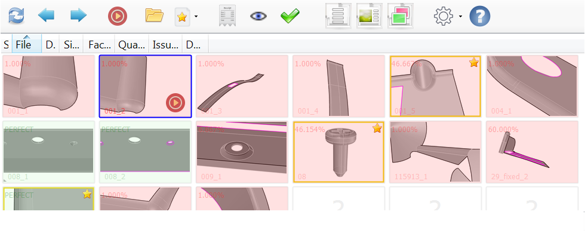
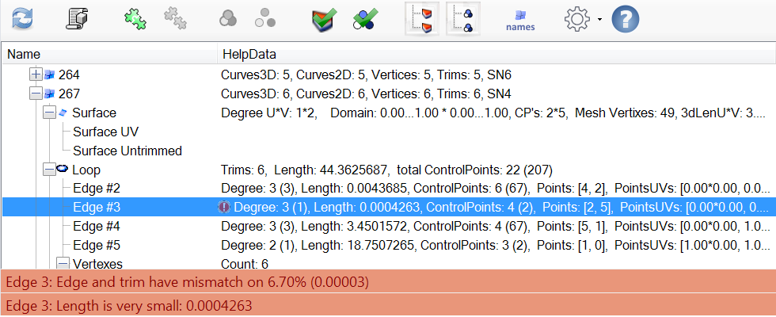
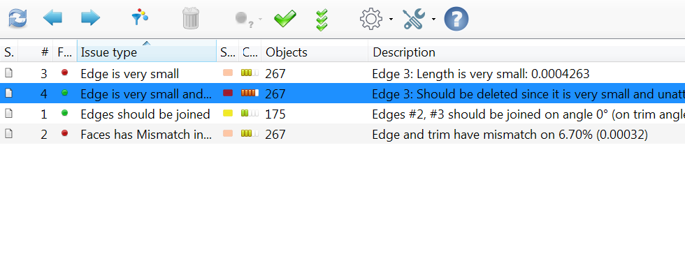

> A delightfully simple CAD fixing system for [Rhinoceros 3D](https://www.rhino3d.com)

- Zero knowledge to start fixing CAD models
- Fully automated with two simple buttons Find and Fix
- Full integration into Rhino
- Detailed information about every aspect of Nurbs and issue
- Ready to work with huge models
- Multithreading support

> **Search -- Analize -- Fix**

| | | |
|-|-|-|
| Models manage | Issues analyze | Issues search/fix |
| |  | | 

 

[Get Started](getstarted)
