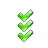

# Panels

Плагін складається з декількох панелей які фокусуються на певній області задач:
 - [Issues Panel](#issues-panel) -  Пошук та виправлення помилок
 - [Objects Panel](#objects-panel) - Детальна інформація про площини
 - [Files Panel](#files-panel) - Файли над якими йде робота та їх здоровья
 - [Mesh Panel](#mesh-panel) - Мешування і збереження в OBJ файл
 - [Topology Panel](#topology-panel) - Топологія що будується на льоту помагає бачити помилки
 - [Tricks Panel](#tricks-panel) - Різні утиліти для пришвидшення роботи

<figure class="thumbnails">
    
    
    
</figure>
<figure class="thumbnails">
    
    
    
</figure>

## Issues Panel

Автоматизований пошук проблем дозволяє знайти навіть найменші приховані проблеми. У поєднанні з автоматичним виправленням помилок ця панель забезпечує максимальну якість моделі за короткий час з мінімальними зусиллями.

Проблеми виділяються у вікні перегляду, щоб полегшити їх перегляд. Також можна збільшити масштаб для видачі подвійним клацанням миші по ньому.

Пошуки та виправлення обчислюються з використанням усіх ядер ЦП для максимальної продуктивності. Інтуїтивно зрозумілий рядок прогресу відображатиме поточний прогрес і дозволяє перервати роботу, якщо це займе багато часу.

Button | Function
--- | --- 
 | Пошук проблем: оновіть список проблем та видаліть застарілі проблеми. Рекомендований ярлик - F5.  
 | Перейдіть до попереднього випуску та виділіть його у вікні перегляду. Рекомендований ярлик - F6.  
 | Перейдіть до наступного випуску та виділіть його у вікні перегляду. Рекомендовані ярлики - F7.  
 | Фільтрувати проблеми: показувати лише вибраний тип проблем. Це покращить зручність навігації. Завершивши, натисніть синє посилання в рядку стану «Очистити всі фільтри», щоб видалити всі фільтри та переглянути всі типи проблем. Активація фільтра зменшить проблеми. У рядку стану з’явиться синє посилання, що дозволяє скасувати фільтр. 
 | Ігнорувати проблему: це зробить проблему вимкненою для автоматичних виправлень і позначить проблему сірою. Цей стан зберігатиметься між оновленнями. Не всі проблеми можна ігнорувати. 
 | Можливі варіанти виправлення для вибраної проблеми: деякі проблеми мають мало можливих виправлень, але можна застосувати лише одне з них. За допомогою цього меню ви можете вибрати, яке саме виправлення буде застосовано при натисканні кнопки «Виправити вибрану проблему». Після натискання цієї кнопки з’явиться спливаюче меню зі списком можливих виправлень. Клацніть на будь-який з них, щоб активувати можливе виправлення як виправлення за замовчуванням. Наведення курсору миші попередньо перегляне можливість виправлення у вікні перегляду. 
 | Виправити вибрану проблему: виправити вибрану проблему або кілька вибраних проблем. Ця кнопка підходить для ручних виправлень з точним розумінням того, що виправлено. За допомогою кнопки «Можливі варіанти виправлення для обраної проблеми» ви можете точно контролювати процес виправлення.  
 | Виправте вибрану проблему та всі невідповідні проблеми до вибраної: може бути небагато ідентичних проблем, які стосуються різних об’єктів. За допомогою цієї кнопки ви можете прискорити процес виправлення, виправивши кілька однакових проблем.  
 | Параметри: варіанти пошуку проблем та їх усунення.  
 | Параметри випуску: відкрийте спливаюче меню зі списком розпізнаних проблем та опціями для них.  
 | Відкрийте цю веб-сторінку з повною допомогою для цієї панелі.
## Objects Panel

Панель "Об'єкт" дозволяє побачити всі об'єкти у відкритому файлі та їх властивості.
Коли пошук питань здійснювався на панелі SerchForIssues, також відображаються проблеми, пов’язані з відповідним об’єктом.
Конфігуровані параметри дозволяють бачити багато властивостей об'єктів у вікні перегляду.

Button | Function
--- | --- 
 |  Оновіть список об’єктів.  
 |  Показати дані об’єкта  
 |  Складіть усі об'єкти в моделі Об’єднайте всі об’єкти від шару до багатоповерхового об’єкта (brep). Працює як команда '_Join'.  
 |  Розкладіть усі об'єкти в моделі. Розбийте всі поліповерхні на шари. Усі обличчя матимуть індивідуальний Brep, тому виправлення буде простішим. Працює як команда '_Explode'. Крім того, він дає унікальні імена об'єктам. Кнопка активна, лише якщо в моделі є поліповерхні (є що розкласти)  
 |  Групувати виділені об’єкти. Те саме, що команда "_Group". Кнопка активна, лише якщо вибрано принаймні 2 об’єкти.  
 |  Розгрупувати вибрані об'єкти. Те саме, що і команда '_Ungroup'. Кнопка активна, лише якщо вибрана якась група.  
 |  Виправити шари 1) Видаліть порожні шари  
 |  Виправити групи 1) Видаліть порожні групи 2) Видалити групи, які мають лише 1 об’єкт  
 |  Показати дерево шарів  
 |  Показати дерево груп  
 |  Показувати назви поверхонь у вікні перегляду  
 |  Показати параметри панелі об’єктів  
 |  Перейдіть на веб-сторінку довідки

## Files Panel

Панель файлів позволяє швидко відкривати файли а також бачити наочно в яких файлах є помилки.
Також це суттєво пришвидшує тестування на великих обємах моделей.

Button | Function
--- | --- 
 | Оновити список файлів у разі якщо вмістиме папки змінилося.  
 | Відкрити попередній файл.  
 | Відкрити наступний файл.  
 | Встановіть або видаліть поточний файл як файл запуску при запуску Rhino. Файлом запуску може бути лише один файл. Щоб видалити файл запуску: а) натисніть кнопку, коли файл завантаження завантажується в Rhino. б) натисніть кнопку, коли жоден документ не завантажений. в) двічі клацніть на кнопку - вона спочатку встановиться, а потім видалиться.  
 | Змінити папку. У цьому списку будуть усі файли з вибраної папки. Включені підпапки.  
 | Додавання або видалення файлів із вибраного. Дозволяє швидко переходити між файлами з різних папок. Дозволяє запам’ятовувати файли та працювати з ними пізніше. Значно пришвидшує тестування та управління файлами у величезних папках.  
 | Показати інформацію про файл у консолі.  
 | Відновити попередній перегляд зображення Зазвичай зображення попереднього перегляду створюється при відкритті файлу. Але іноді потрібні для створення попереднього перегляду зображення з екрану. За допомогою цієї кнопки ви можете генерувати зображення попереднього перегляду з екрану (як виглядає модель зараз).  
 | Виправте всі проблеми у поточному документі  
 | Переключіть перегляд файлів на Інформаційний перегляд  
 | Переключіть перегляд файлів на Зображення + Перегляд інформації  
 | Переключіть перегляд файлів на Перегляд зображення  
 | Змінити параметри панелі Файли  
 | Перейти на веб-сторінку довідки
 | Попередній перегляд виправлень у всіх файлах. Усі файли буде відкрито по одному та виправлено з усіх питань. Значки, кольори та статистика будуть оновлені. По завершенні - поточний відкритий файл буде знову відкритий.  
 | Деякі файли не є 3dm. Перетворення всіх файлів, що не є 3DM, у 3DM покращує ефективність наступного відкриття файлу. Нові файли 3dm відкриються швидко.  
 | Пошук проблем у всіх файлах. Усі файли відкриватимуться по одному та шукатимуть проблеми. Значки, кольори та статистика будуть оновлені. По завершенні - поточний відкритий файл буде знову відкритий.

## Mesh Panel

Панель Mesh дозволяє генерувати нову сітку з поверхонь та зберігати її у форматі файлу OBJ.
Ця панель допомагає автоматизувати модель перетворення в інші редактори сіток, такі як 3ds Max.

## Topology Panel

Панель "Топологія" дозволяє змінити режим відображення, щоб краще бачити топологію та переглядати інформацію про топологію.
Об'єкти топології приховані від користувача прихованими шарами і не зберігаються у файлі.
Побудова топології необхідна для пошуку та виправлення проблем і дуже оптимізована для продуктивності.
Топологія оновлюється автоматично кожного разу, коли використовується сцена оновлення, і тому не вимагає уваги користувача.
Хоча для автоматичного оновлення проблему на панелі "Проблеми" слід оновлювати вручну.

Button | Function | Screenshot
--- | ---  | --- 
 | Оновіть топологію та перевірте якість топології. Хоча топологія оновлюється автоматично, ця кнопка дозволяє примусово оновлювати. |
 | Спеціальні режими відображення дозволяють побачити модель у 3-х режимах відображення: 1) Ghosted: у цьому режимі жоден колір не фарбується.  2) Топологія: у цьому режимі лінії топології забарвлюються у різні кольори, тому легко зрозуміти, де знаходиться зазор та одинарне з'єднання.  3) Сітка: у цьому режимі сітка видно.  Перед використанням цього користувацького режиму користувач повинен спочатку встановити їх. Для цього користувачеві слід імпортувати файли  SolidFix_Ghosted.ini  SolidFix_Mesh.ini  SolidFix_Topology.ini  SolidFix_TopologyColoredSurfaces.ini  з папки SolidFix\DisplayModes, яка знаходиться в папці Rhino plugins. | 
 | Прапорець Блокувати об'єкт топографії дозволяє блокувати або розблоковувати об'єкти топографії. Коли заблоковано - об'єкти топо не можна вибрати. Коли розблоковано - об’єкти топо можна вибрати, і інформація відображатиметься у списку. Це допомагає налагоджувати алгоритми. |

## Tricks Panel

Панель Tricks розширює Rhino за допомогою деяких невеликих функцій, які зроблять роботу приємнішою.

Option | Function | Screenshot
--- | --- | --- 
Load document at Rhino startup | Дозвольте запустити Rhino із попередньо завантаженою моделлю. Те саме, що кнопка StartupFile на панелі Файли.  |
Change rotation point on Mouse-Double-Click | Дозволяє швидко змінювати точку обертання, натиснувщи двічі клацанням миші. Зміна точки обертання дозволить краще зрозуміти місцеву проблему та швидше її вирішити.  |
Restore DisplayMode on document load | Rhino починається з режиму відображення за замовчуванням і показує 4 перегляди. Ця опція дозволяє відновити останній вибраний режим відображення. Дуже корисно для розробників, коли дуже багато разів на день потрібно запускати Rhino.  |
Show rotation point in viewport | Показати точку обертання в порту вигляду, щоб покращити орієнтацію. | 
Show selection info in viewport | Покажіть у лівому нижньому куті, які об’єкти виділено та до яких груп вони належать. |   
Show how many is hidden in viewport | У верхньому лівому куті покажіть інформацію про приховану кількість поверхонь. Це допоможе уникнути збереження файлів із прихованими об'єктами і, отже, покращує загальний робочий процес. |   